<div align="center">

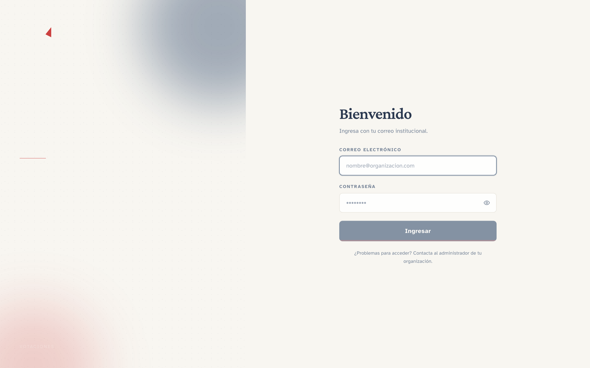

# Open Quorum

**Sistema de votaciones en línea open-source para consejos, juntas directivas y asambleas.**

*Mentimeter-level UX · proyector en vivo · voto confidencial auditable · branding por instalación.*


</div>

---

## ¿Qué hace?

Corre una asamblea completa con **tres pantallas sincronizadas por Server-Sent Events**:

- **Control** — el admin abre/cierra/revela cada pregunta desde su panel
- **Proyector** — segunda pantalla full-screen, se actualiza al instante
- **Votante** — teléfono o laptop de cada persona invitada

El voto se **vincula al usuario en la base de datos** (para auditoría y para evitar dobles votos), pero **nunca se muestra individualmente en ninguna UI** — solo agregados. Los resultados quedan como histórico permanente al finalizar el evento.

## Features

- 🎭 **Tres roles**: Admin, Reviewer (solo-lectura), Votante
- 📊 **3 tipos de pregunta**: Opción múltiple (con fotos opcionales), Sí/No, Escala 1–5
- 🔴 **Tiempo real** vía SSE — sin WebSockets, sin Redis, stack simple
- 🎨 **Branding configurable** por instalación — nombre, logo, 3 paletas preset (institucional / esmeralda / carbón)
- 🏷️ **Tags** para categorizar eventos con colores editables inline
- ✉️ **Invitación por link** mágico con activación de contraseña
- 🔒 **Voto confidencial**: `Voto.userId` en DB, jamás expuesto par `(userId, respuesta)`
- 📈 **Contador de participación** siempre visible (`N/M · %`) en control y proyector, aun sin revelar
- 📜 **Histórico** al finalizar — resultados agregados quedan visibles en cada pregunta
- ♿ **Accesible**: `focus-visible`, `aria-live`, `prefers-reduced-motion`, labels asociados
- 🧪 **45 tests** unitarios (Vitest) + smoke E2E (Playwright)

## Screenshots

### Login


Split-panel editorial con monograma CGR, tipografía Crimson Pro + Atkinson Hyperlegible, tema por defecto *institucional*.

---

### Admin — Eventos

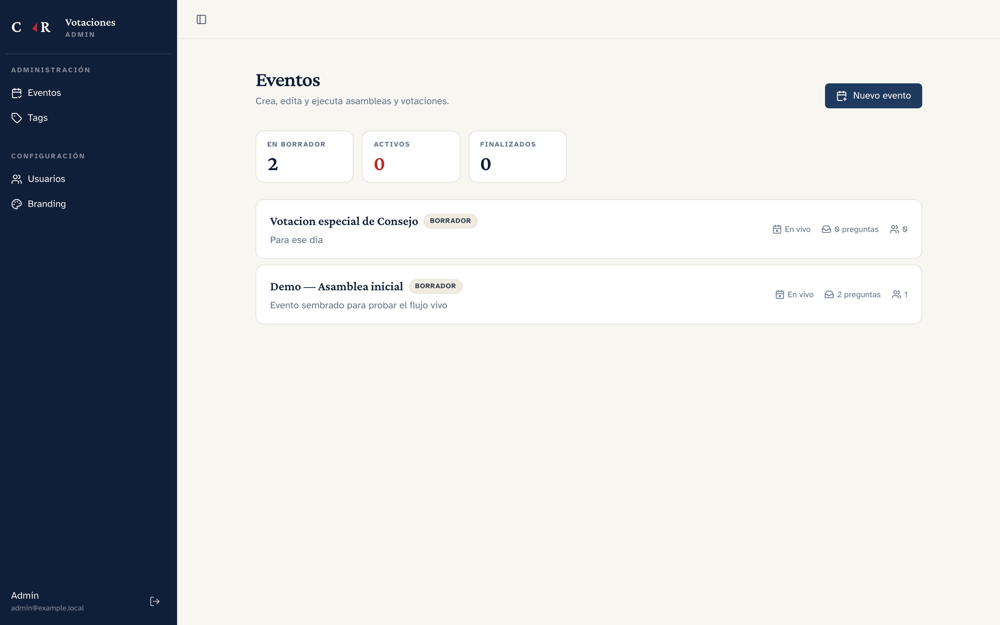

Lista con stats (borrador / activos / finalizados), pills de estado, meta en una sola línea. Empty state con CTA cuando no hay eventos.

---

### Admin — Detalle de evento (BORRADOR)

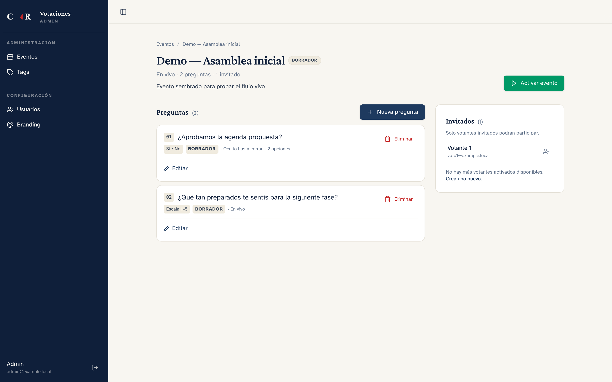

Columna principal con lista de preguntas + inline edit (solo en borrador). Columna lateral con invitados: selección múltiple o *"Invitar a todos"* en un click.

---

### Nueva pregunta — modal

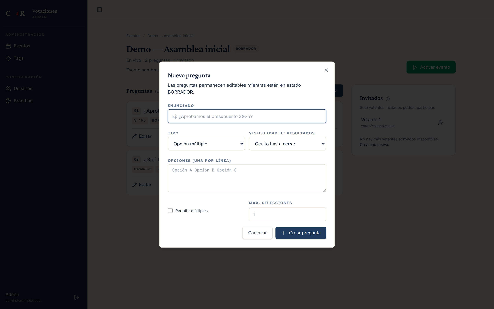

Form type-aware: según el tipo elegido aparecen campos específicos (opciones / escala / nada). Autofocus, spinner al crear, cancelable con Esc.

---

### Control en vivo

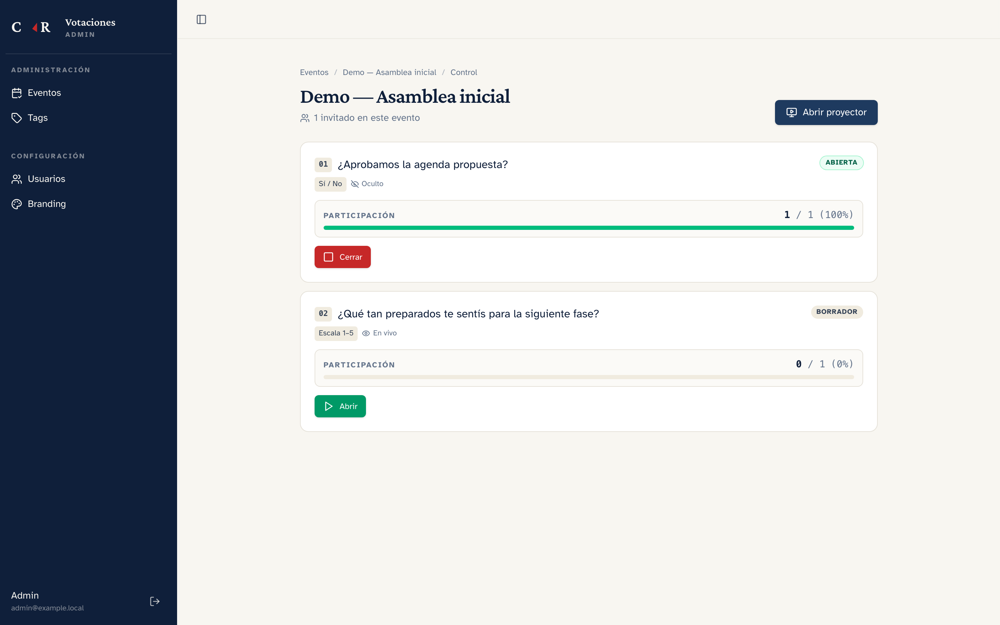

Una card por pregunta con barra de **participación persistente** (`N/M · %`). Botones contextuales: Abrir → Cerrar → Revelar. Click en *"Abrir proyector"* abre la segunda pantalla.

---

### Proyector — segunda pantalla

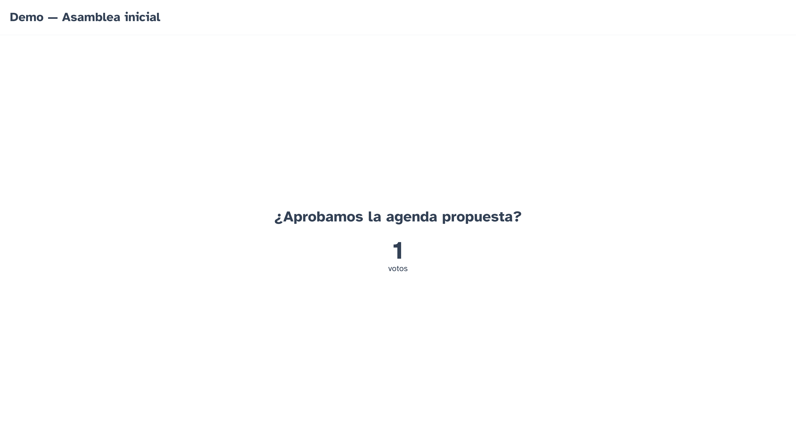

Full-screen minimalista para la sala. La píldora inferior muestra *"N / M personas han votado"* aun cuando el resultado está oculto (el público ve la participación subir sin ver todavía el resultado).

---

### Votante — móvil

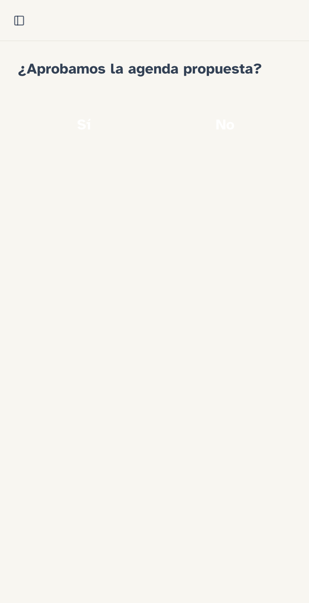

Vista mobile-first, autoactualiza con SSE cuando el admin abre la próxima pregunta.

---

### Branding — 3 temas preset

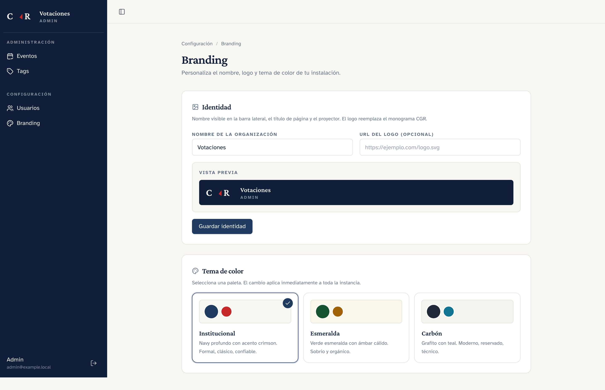

Edita el nombre y logo de la organización + elige entre **Institucional** (navy + crimson), **Esmeralda** (verde + ámbar) o **Carbón** (grafito + teal). El cambio aplica inmediatamente a toda la instancia.

---

### Tags — colores editables

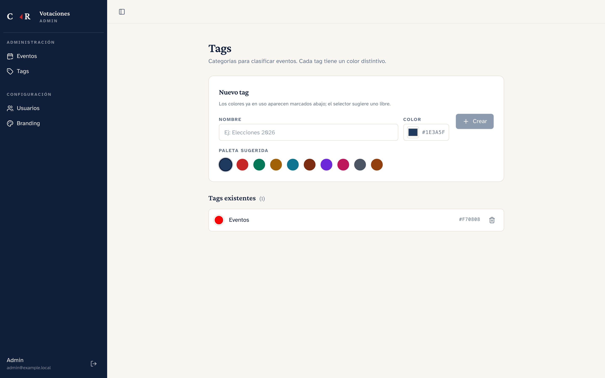

Paleta de 10 colores curados; los ya usados aparecen atenuados con marca crimson. Click en el swatch de un tag existente abre el color picker para modificar.

---

### Histórico al finalizar

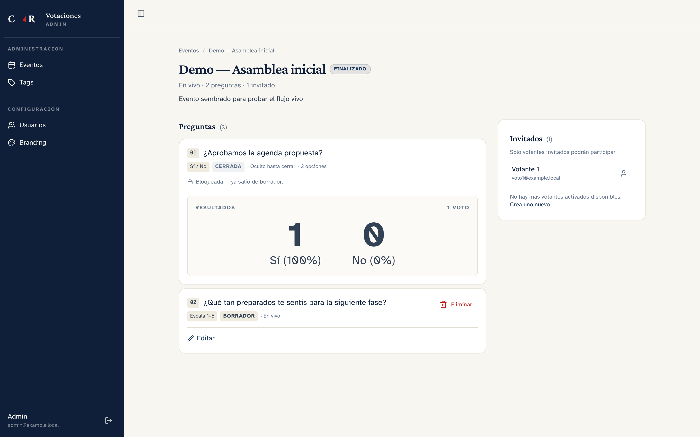

Al finalizar, cada pregunta muestra un bloque *"Resultados"* con el agregado permanente. Sirve como acta.

---

## Flujo de una sesión en vivo

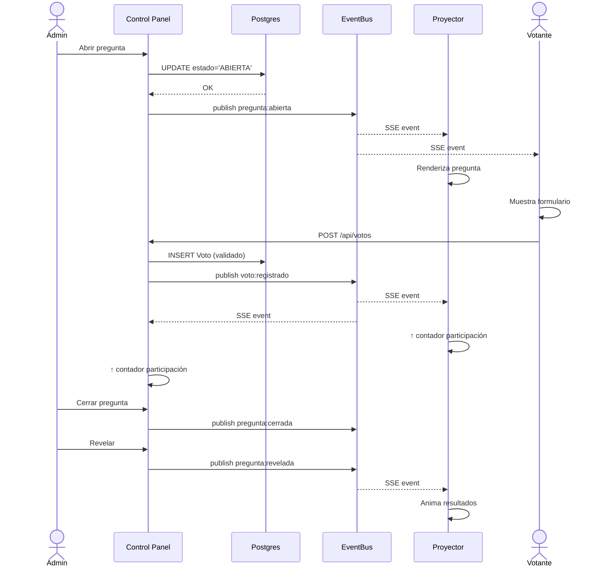

## Quick start

Requiere Docker + Docker Compose.

```bash
# 1. Clonar
git clone git@github.com:juandanielpujols/open-quorum.git
cd open-quorum

# 2. Variables de entorno
cp .env.example .env.local
# Edita AUTH_SECRET con: openssl rand -base64 32

# 3. Levantar Postgres + app
docker compose up -d

# 4. Aplicar schema y seed
npm install
npx prisma migrate deploy
npx prisma db seed
```

Abre **http://localhost:3002**.

### Cuentas seed

| Rol | Email | Contraseña |
|---|---|---|
| Admin | `admin@example.local` | `admin1234` |
| Reviewer | `reviewer@example.local` | `review1234` |
| Votante | `voto1@example.local` | `voto1234` |

Viene incluido un evento demo (*"Demo — Asamblea inicial"*) en borrador con dos preguntas y el votante invitado, listo para recorrer el flujo.

## Stack

| Capa | Tecnología |
|---|---|
| Framework | Next.js 16 (App Router, standalone) |
| UI | Tailwind CSS 4 + shadcn/ui + Radix primitives + Lucide icons |
| Tipografía | Crimson Pro (display) + Atkinson Hyperlegible (sans) via `next/font` |
| DB | PostgreSQL 16 |
| ORM | Prisma v7 + `@prisma/adapter-pg` |
| Auth | Auth.js v5 (Credentials + bcrypt cost 12) |
| Tiempo real | Server-Sent Events + in-memory EventBus |
| Tests | Vitest + @testing-library/react + happy-dom; Playwright (E2E) |
| Deploy | Docker Compose (Postgres + app standalone) |

## Arquitectura

```
src/
├── app/                          # Next.js App Router
│   ├── login/                    # Entrada pública
│   ├── activar/                  # Flujo de activación de cuenta
│   ├── admin/
│   │   ├── eventos/              # Lista + detalle + control + nuevo
│   │   ├── tags/                 # Tags manager
│   │   ├── usuarios/             # Invitación + lista
│   │   └── configuracion/        # Hub + branding
│   ├── reviewer/                 # Read-only mirror
│   ├── votante/                  # Votación
│   ├── proyectar/[eventoId]/     # Full-screen segunda pantalla
│   └── api/                      # Auth, stream SSE, votos, snapshot
├── components/
│   ├── app-shell.tsx             # Sidebar + top bar + branding-aware
│   ├── preguntas/                # Un módulo por tipo (Schema/Voter/Projector/agregar)
│   ├── eventos/                  # Dialogs (Finalizar, Nueva pregunta)
│   ├── tags/                     # Tags manager client
│   ├── proyector/                # Frame full-screen
│   └── ui/                       # shadcn components
├── lib/
│   ├── auth.ts + authorize.ts    # Auth.js + logic separado por Vitest
│   ├── db.ts                     # Prisma singleton
│   ├── branding.ts               # TEMAS registry + obtenerBranding cached
│   ├── eventbus.ts               # In-memory pub/sub
│   ├── sse.ts                    # ReadableStream helper
│   ├── permissions.ts            # can() con catálogo de acciones
│   └── rate-limit.ts             # Token bucket in-memory
├── server/                       # Lógica de dominio
│   ├── eventos.ts
│   ├── preguntas.ts
│   ├── votos.ts
│   ├── snapshot.ts
│   ├── usuarios.ts
│   ├── activacion.ts
│   └── tags.ts
└── proxy.ts                      # Role-based route guards (Next 16 convention)
```

### Cada tipo de pregunta es auto-contenido

```
src/components/preguntas/opcion-multiple/
├── Schema.ts      # Zod: ConfigOpcionMultiple + RespuestaOpcionMultiple
├── Voter.tsx      # UI del votante (mobile-first)
├── Projector.tsx  # UI del proyector (chart)
└── agregar.ts     # Función pura de agregación
```

Agregar un tipo nuevo = una carpeta nueva + un entry en el registry central. No hay switch gigantes repartidos por varios archivos.

## Roles y permisos

| Acción | Admin | Reviewer | Votante |
|---|:---:|:---:|:---:|
| CRUD usuarios / eventos / preguntas / tags | ✅ | ❌ | ❌ |
| Abrir / cerrar / revelar / finalizar | ✅ | ❌ | ❌ |
| Ver agregados históricos | ✅ | ✅ | ❌ |
| Proyector | ✅ | ❌ | ❌ |
| Votar (solo en eventos invitados) | ❌ | ❌ | ✅ |
| Configurar branding | ✅ | ❌ | ❌ |

Enforcement en 3 capas: middleware (`src/proxy.ts`), helper de dominio (`lib/permissions.ts`), queries con filtros por sesión en el servidor.

## Comandos de desarrollo

```bash
# Dev server (sin Docker)
npm run dev

# Tests
npm test                    # Vitest unit tests
npm run test:watch
npm run e2e                 # Playwright smoke

# Verificación
npm run type-check          # tsc --noEmit --skipLibCheck
npm run build               # Build producción

# Docker
docker compose up -d
docker compose build votaciones-app
docker compose logs votaciones-app -f

# DB
npx prisma migrate dev --name descripcion
npx prisma generate
npx prisma db seed

# Screenshots para el README
npx tsx scripts/capturar-screenshots.ts
```

## Roadmap

- [x] **Fase 0**: Fundamento — Next 16 + Postgres + Auth + Docker + tests
- [x] **Fase 1**: MVP votación en vivo — 3 tipos + SSE + control + proyector + invitados + histórico + branding + tags
- [ ] **Fase 2**: Modo asíncrono + emails Resend + PDF resumen + proxy voting (voto por representación)
- [ ] **Fase 3**: Ranking, nube de palabras, respuesta abierta, quiz con timer, Q&A con upvote, heatmap sobre imagen
- [ ] **Fase 4**: Pulido — animaciones Framer Motion, accesibilidad avanzada, dark mode

Ver spec completo en [`docs/superpowers/specs/2026-04-19-sistema-votaciones-design.md`](docs/superpowers/specs/2026-04-19-sistema-votaciones-design.md).

## Contribuir

Open Quorum es open-source y domain-agnostic — ninguna referencia a organización consumidora vive en código fuente. Si lo usas en tu institución, configurá `APP_NAME`, sube tu logo y elegí el tema desde `/admin/configuracion/branding`.

Issues y PRs son bienvenidos en https://github.com/juandanielpujols/open-quorum

## Licencia

MIT. Ver [LICENSE](LICENSE).

---

<div align="center">
<sub>Construido con Next.js, Prisma, shadcn/ui y mucha atención al detalle.</sub>
</div>
